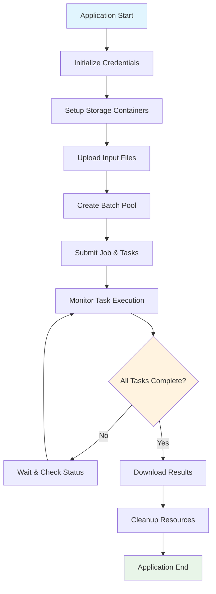

# 🏗️ CutifyPets Architecture Guide

This document provides a detailed overview of the CutifyPets application architecture, including Azure services integration, data flow, and technical design decisions.

## 📋 Table of Contents

- [Overview](#overview)
- [Azure Services](#azure-services)
- [Application Flow](#application-flow)
- [Component Architecture](#component-architecture)
- [Data Flow](#data-flow)
- [Security Considerations](#security-considerations)
- [Scalability Design](#scalability-design)
- [Error Handling](#error-handling)
- [Performance Optimization](#performance-optimization)

## 🌐 Overview

CutifyPets is a cloud-native application built on Azure that processes video files at scale using a distributed computing approach. The application leverages Azure Batch for parallel processing and Azure Storage for reliable file management.

### Key Architectural Principles

- **Scalability**: Horizontal scaling through Azure Batch compute pools
- **Reliability**: Fault-tolerant design with retry mechanisms
- **Cost Efficiency**: Use of low-priority VMs to minimize costs
- **Security**: Secure credential management and access control
- **Maintainability**: Clean separation of concerns and modular design

## ☁️ Azure Services

### Azure Batch

**Role**: Distributed compute orchestration
**Configuration**:
- Pool: Windows Server 2012 R2 nodes
- VM Size: STANDARD_D2_v2 (2 cores, 7GB RAM)
- Scaling: 0 dedicated + 3 low-priority nodes
- Application Package: FFmpeg 3.4

**Key Features Used**:
- Job scheduling and task management
- Application package deployment
- Node auto-provisioning
- Task state monitoring

### Azure Blob Storage

**Role**: File storage and transfer
**Containers**:
- `input`: Source MP4 files with read access
- `output`: Generated GIF files with write access

**Key Features Used**:
- Shared Access Signatures (SAS) for secure access
- Hierarchical storage management
- REST API integration

### Azure Resource Manager

**Role**: Resource provisioning and management
**Resources Managed**:
- Batch accounts and pools
- Storage accounts and containers
- Access keys and permissions

## 🔄 Application Flow



### Detailed Flow Steps

1. **Initialization Phase**
   - Read environment variables for Azure credentials
   - Validate connection to Batch and Storage accounts
   - Initialize Azure SDK clients

2. **Storage Setup Phase**
   - Create input/output blob containers if they don't exist
   - Upload MP4 files from local InputFiles directory
   - Generate SAS tokens for secure access

3. **Compute Provisioning Phase**
   - Create or reuse Azure Batch pool
   - Install FFmpeg application package on nodes
   - Verify pool readiness

4. **Job Execution Phase**
   - Create batch job linked to the pool
   - Generate individual tasks for each input file
   - Submit tasks with FFmpeg conversion commands

5. **Monitoring Phase**
   - Poll task status until completion or timeout
   - Handle failed tasks and retry logic
   - Collect execution logs and metrics

6. **Results & Cleanup Phase**
   - Verify output files in storage
   - Clean up input containers and temporary resources
   - Optionally delete pools and jobs

## 🧩 Component Architecture

### Program.cs Structure

```csharp
class Program
{
    // Configuration Constants
    private const string POOL_ID = "WinFFmpegPool";
    private const string JOB_ID = "WinFFmpegJob";
    
    // Core Methods
    static async Task Main(string[] args)           // Orchestrates entire workflow
    InitializeAzureCredentials()                   // Environment variable setup
    SetupAzureStorage()                           // Storage client initialization
    CreateBlobContainersAsync()                   // Container provisioning
    UploadInputFilesAsync()                       // File upload with SAS
    RunAzureBatchJobAsync()                       // Batch processing orchestration
    CleanupResourcesAsync()                       // Resource deallocation
    
    // Batch Operations
    CreateBatchPoolAsync()                        // Pool creation and configuration
    CreateJobAsync()                             // Job definition and submission
    AddTasksAsync()                              // Task generation and queuing
    MonitorTasksAsync()                          // Status monitoring and completion
    
    // Storage Operations
    UploadResourceFileToContainerAsync()         // Individual file upload
    GetContainerSasUrl()                         // SAS token generation
    CreateContainerIfNotExistAsync()             // Container management
}
```

### Key Components

#### 1. Credential Management
- Environment variable validation
- Azure authentication handling
- Secure key storage and retrieval

#### 2. Storage Manager
- Blob container lifecycle management
- File upload/download operations
- SAS token generation and management

#### 3. Batch Orchestrator
- Pool provisioning and scaling
- Job and task lifecycle management
- Progress monitoring and error handling

#### 4. FFmpeg Integration
- Command line construction
- Parameter optimization for GIF conversion
- Output file management

## 📊 Data Flow

### Input Processing Flow

```
Local MP4 Files → Blob Storage (input container) → Batch Tasks → FFmpeg Processing → Blob Storage (output container)
```

### Detailed Data Flow

1. **Local to Cloud Transfer**
   ```
   InputFiles/*.mp4 → Azure Blob Storage
   - Individual file upload with progress tracking
   - SAS token generation for Batch access
   - Metadata preservation
   ```

2. **Batch Task Distribution**
   ```
   Input Files → Task Queue → Compute Nodes
   - One task per input file
   - Resource file associations
   - Command line parameter injection
   ```

3. **Processing Execution**
   ```
   Compute Node → Download Input → FFmpeg Processing → Upload Output
   - Parallel execution across multiple nodes
   - Independent task processing
   - Automatic retry on transient failures
   ```

4. **Result Aggregation**
   ```
   Output Files → Result Verification → Local Download (Optional)
   - Success/failure status collection
   - Output file validation
   - Cleanup of temporary resources
   ```

## 🔐 Security Considerations

### Authentication & Authorization

- **Azure AD Integration**: Service principal authentication for production
- **Key Management**: Environment variable storage for development
- **SAS Tokens**: Time-limited access to storage resources
- **Network Security**: VNet integration for enhanced isolation

### Data Protection

- **Encryption at Rest**: Azure Storage encryption by default
- **Encryption in Transit**: HTTPS/TLS for all API communications
- **Access Control**: Minimal permission principles
- **Audit Logging**: Azure Activity Log integration

### Best Practices Implemented

```csharp
// Secure credential handling
private static void InitializeAzureCredentials()
{
    // Never hardcode credentials
    _batchAccountKey = Environment.GetEnvironmentVariable(ENV_VAR_BATCH_KEY) ?? string.Empty;
    
    // Validate required credentials
    if (string.IsNullOrEmpty(_batchAccountKey))
        throw new InvalidOperationException("Batch account key not configured");
}

// Time-limited SAS tokens
SharedAccessBlobPolicy sasConstraints = new SharedAccessBlobPolicy
{
    SharedAccessExpiryTime = DateTime.UtcNow.AddHours(2), // Limited lifetime
    Permissions = SharedAccessBlobPermissions.Read         // Minimal permissions
};
```

## 📈 Scalability Design

### Horizontal Scaling

- **Compute Nodes**: Auto-scaling based on queue depth
- **Task Parallelism**: Independent task execution
- **Resource Pooling**: Shared compute resources across jobs

### Vertical Scaling Options

```csharp
// VM Size Configuration
private const string POOL_VM_SIZE = "STANDARD_D2_v2";  // 2 cores, 7GB RAM

// Alternative configurations for different workloads:
// "STANDARD_D4_v2"  // 8 cores, 28GB RAM - for complex processing
// "STANDARD_F2s_v2" // 2 cores, 4GB RAM  - for CPU-intensive tasks
// "STANDARD_H16r"   // 16 cores, 112GB RAM - for high-memory requirements
```

### Performance Optimization Strategies

1. **Pool Pre-warming**: Keep pools ready for immediate job execution
2. **Application Package Caching**: Pre-install FFmpeg on node images
3. **Storage Optimization**: Use premium storage for high I/O workloads
4. **Network Optimization**: Co-locate storage and compute in same region

## ⚠️ Error Handling

### Exception Categories

1. **Transient Errors**
   - Network timeouts
   - Storage throttling
   - Batch service temporary unavailability

2. **Configuration Errors**
   - Invalid credentials
   - Missing environment variables
   - Malformed resource references

3. **Processing Errors**
   - Invalid input files
   - FFmpeg execution failures
   - Insufficient compute resources

### Retry Strategies

```csharp
// Batch pool creation with retry logic
try
{
    await pool.CommitAsync();
}
catch (BatchException be)
{
    if (be.RequestInformation?.BatchError?.Code == BatchErrorCodeStrings.PoolExists)
    {
        Console.WriteLine($"The pool [{poolId}] already exists.");
    }
    else
    {
        throw; // Re-throw for unexpected errors
    }
}
```

### Monitoring and Alerting

- **Task State Monitoring**: Real-time status tracking
- **Timeout Handling**: Configurable execution limits
- **Log Aggregation**: Centralized logging for troubleshooting
- **Metrics Collection**: Performance and usage analytics

## 🚀 Performance Optimization

### Compute Optimization

- **Low-Priority VMs**: 80% cost reduction with interruption handling
- **Spot Instance Management**: Automatic failover strategies
- **Resource Right-sizing**: Match VM specs to workload requirements

### I/O Optimization

- **Parallel Uploads**: Concurrent file transfer operations
- **Blob Storage Tiers**: Hot/Cool storage optimization
- **Caching Strategies**: Local disk caching on compute nodes

### FFmpeg Optimization

```bash
# Optimized GIF conversion command
ffmpeg -i input.mp4 -vf "fps=15,scale=320:-1:flags=lanczos,palettegen" palette.png
ffmpeg -i input.mp4 -i palette.png -lavfi "fps=15,scale=320:-1:flags=lanczos [x]; [x][1:v] paletteuse" output.gif
```

**Optimization Parameters**:
- `fps=15`: Reduced frame rate for smaller file size
- `scale=320:-1`: Consistent width with aspect ratio preservation
- `palettegen/paletteuse`: High-quality color optimization
- `flags=lanczos`: Superior scaling algorithm

---

## 📚 Additional Resources

- [Azure Batch Documentation](https://docs.microsoft.com/azure/batch/)
- [Azure Storage Best Practices](https://docs.microsoft.com/azure/storage/common/storage-performance-checklist)
- [FFmpeg Documentation](https://ffmpeg.org/documentation.html)
- [.NET Azure SDK Reference](https://docs.microsoft.com/dotnet/api/overview/azure/)

For technical questions about the architecture, please refer to our [Contributing Guide](CONTRIBUTING.md) or open an issue in the repository.
